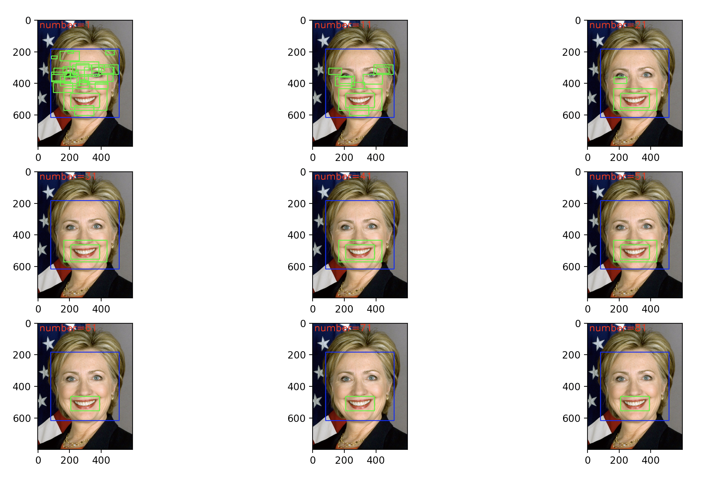

# Computer Vision and Machine Learning Projects
This folder contains different AI applications. List of these applications can be seen in the table of contents.
## Table of Contents
* [facial_landmark_detection.py](#facial_landmark_detection)
* [face_smile_detection.py](#face_smile_detection)
* [optical_flow_tracker.py](#optical_flow_tracker)
* [pedestrian_detection.py](#pedestrian_detection)
* [delaunay_voronoi.py](#delaunay_voronoi)

[comment]: <> (* [Screenshots]&#40;#screenshots&#41;)

[comment]: <> (* [Setup]&#40;#setup&#41;)

[comment]: <> (* [Usage]&#40;#usage&#41;)

[comment]: <> (* [Project Status]&#40;#project-status&#41;)

[comment]: <> (* [Room for Improvement]&#40;#room-for-improvement&#41;)

[comment]: <> (* [Acknowledgements]&#40;#acknowledgements&#41;)

[comment]: <> (* [Contact]&#40;#contact&#41;)
<!-- * [License](#license) -->

## facial_landmark_detection

Landmark detection is a two step process:

- Step1. **Face Detection**:
  
  For best results we should use the same face detector used in training the landmark detector.
  
  Dlib has a built-in face detector which can be accessed using **get_frontal_face_detector()**
  
  (Dlib’s face detector is based on Histogram of Oriented Gradients features and Support Vector Machines (SVM))

- Step2. **Landmark detection**
  
  The landmark detector finds the landmark points inside the face rectangle.
  
  The **shape_predictor** class implements Dlib’s facial landmark detector.

  Dlib’s landmark detector needs two inputs:
  - Input image.
  - Face rectangle

  The output landmarks are stored in an instance of the class full_object_detection.
  
  A few important methods of full_object_detection are listed below
  - **num_parts()** : Number of landmark points.
  - **part(i)** : The ith landmark point
  - **part(i).x()** and **part(i).y()** can be used to access the x and y coordinates of the ith landmark point.

Result:
This script detects facial landmarks and plot them on a face image.

## face_smile_detection
Object Detection using Haar Cascades.

This script uses haar cascade for detecting face and smile in an image. The trained model for face detection and smile detection is downloaded from this link:

[https://github.com/opencv/opencv/tree/master/data/haarcascades]

The main function used in the script is **detectMultiscale**.

Result:

## optical_flow_tracker
Motion estimation using optical flow.
- Step1: **Detect Corners for tracking them**
  
  Using the Shi Tomasi corner detection algorithm to find some points which will be tracked over the video.
  
  It is implemented in OpenCV using the function **goodFeaturesToTrack**.

- Step2: **Set up the Lucas Kanade Tracker**
  
  After detecting certain points in the first frame, they will be tracked in the next frame.
  
  This is done using Lucas Kanade algorithm. 

Result:

## pedestrian_detection
Using a HOG Descriptor + SVM classifier for Object Detection.

Using INRIA’s Pedestrian dataset for training a people detector. Dataset contains two sub-folders:
- train_64x128_H96 - contains the cropped images of pedestrians and resized to 64x128 ( Positive Examples )
- test_64x128_H96 - contains cropped images which do not contain pedestrians. ( Negative Examples )
  
The training data can also be downloaded from this link:

[https://www.filepicker.io/api/file/VQKdmzKqSLWruVhx7Xdd]

Results: At the end we compare our model with OpenCV’s default People Detector.
    (Green rectangles for results from our model and red boxes for results from OpenCV’s people detector.)

##delaunay_voronoi

